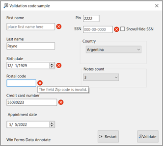

# Windows Form Data Annotation

See :open_book:  [article](https://dev.to/karenpayneoregon/window-forms-data-annotation-276m)

Validation is the first and most important step in securing an application. It prevents the application from processing unwanted inputs that may produce unpredictable results. Couple validation with properly transmitting data to a data source.

When validating data should there be instant feedback? This is subjective, instant feedback will be better when there are many inputs so this would be better than waiting to submit their input. In the case of instant feedback there needs to be events triggered to perform validation while on submit there is a central generic method to perform validation.

## Data Annotations

Data Annotations are nothing but a set of `attributes` which can be used to configure your model classes to validate the input data entered by users. It provides a set of `.NET attributes` that can be applied to data object class properties. These attributes offer a very declarative way to apply `validation rules` directly to a model. Data Annotations are a general purpose mechanism which can be used to feed `metadata` to the `framework`. Framework drives validation from the metadata, and uses the metadata while building the HTML to display and edit models. Well, you can manually validate the view model is ASP.NET Core and Windows Forms too, but using data annotation makes you `validation logic reusable` and also saves time. In addition, it also minimizes the complexity in the action methods. The idea is to add `constraints` metadata to `the properties` in the view model (or in Windows Forms), which can be later picked up by the default binder in the model-binding process.

## Web/APS.NET Core and Razor Pages

## Windows Forms

Validating data in windows forms application is generally done by determining if the information entered by a user is the proper type e.g. price of a product is type decimal, the first and last name of a person entered are not empty strings. In a conventional application, a developer will have logic in a button click event to validate all information entered on a form which has worked for many, yet this logic is locked into a single form/window.  

